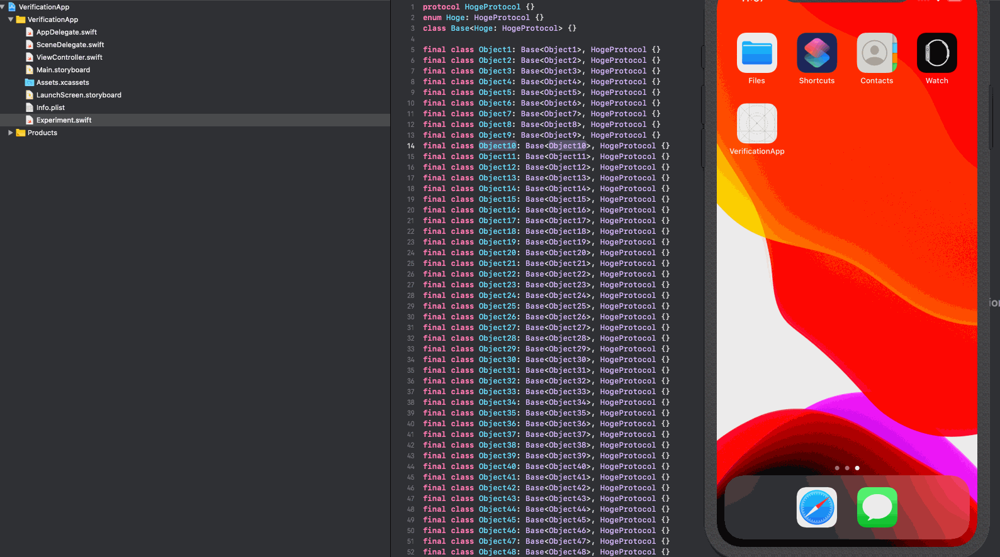

## Overview
This is a verification xcode project.
I witnessed the strange behavior of the app. (**only iOS13**)


1. Specify the protocol (`protocol HogeProtocol`) inherited by the subclass as the Generic Argument of super class (`class Base`)
```Experiment.swift
protocol HogeProtocol {}
enum Hoge: HogeProtocol {}
final class Base<Hoge: HogeProtocol> {}

final class Object1<Hoge: HogeProtocol>:  Base<Object1>, HogeProtocol {}
final class Object2<Hoge: HogeProtocol>:  Base<Object1> {}
final class Object3<Hoge: HogeProtocol>:  Base<Object1> {}
.
.
final class Object1000<Hoge: HogeProtocol>:  Base<Object1> {}
```

2. Initialize `Object1`
```ViewController.swift
import UIKit

class ViewController: UIViewController {

    override func viewDidLoad() {
        super.viewDidLoad()
        _ = Object1()
    }
}
```

3. The following error is output from a certain number or more, and app crashes.

```
type metadata accessor for xxx
```

## GIF


## Get Started
1. Clone
2. Open `VerificationApp.xcodeproj`
3. Run (maybe clash:bomb:)

## Result
The verification results in various environments are as follows. 

### Environment
- Xcode
    - Xcode11.1(Swift5.1)
    - Xcode11.2.1(Swift5.1.3)
    - Xcode11.3(Swift5.1.3)
- Build Configuration
    - Debug
    - Release
- Simulator
    - iOS12.2
    - iOS13.3
- Subclass Count
    - 100
    - 1000

### iOS12
#### Subclass count is 100
Xcode Version|Debug|Release
:-:|:-:|:-:
Xcode11.1|✅|✅
Xcode11.2.1|✅|✅
Xcode11.3|✅|✅

#### Subclass count is 1000
Xcode Version|Debug|Release
:-:|:-:|:-:
Xcode11.1|✅|✅
Xcode11.2.1|✅|✅
Xcode11.3|✅|✅

### iOS13  
#### Subclass count is 100
Xcode Version|Debug|Release
:-:|:-:|:-:
Xcode11.1|✅|✅
Xcode11.2.1|✅|✅
Xcode11.3|✅|✅

#### Subclass count is 1000
Xcode Version|Debug|Release
:-:|:-:|:-:
Xcode11.1|❌|✅
Xcode11.2.1|❌|✅
Xcode11.3|❌|✅

## Conclusion

This bug occurs when building iOS 13 and debug.:thinking:

(+ when you create a lot of subclasses like `class Object`)

## Reference
- https://gist.github.com/marty-suzuki/22969715bfa01196f2a47349bf45b4c4 ([@marty-suzuki](https://github.com/marty-suzuki))
